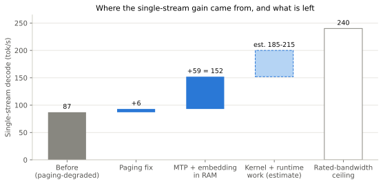
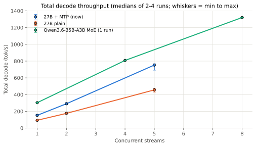
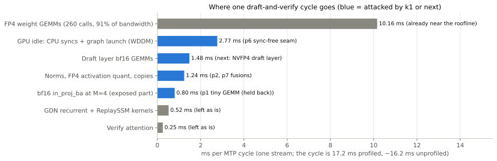
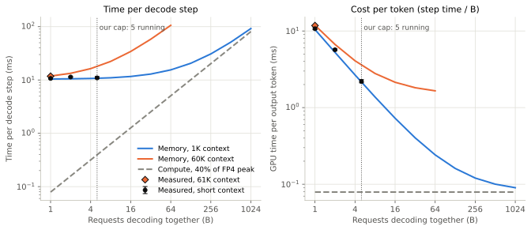

# sglang-rtx5090-mtp

Qwen3.8-27B (NVFP4) on a single RTX 5090 under Windows 11 + WSL2, served with SGLang v0.5.20:
**1.6× faster decode per stream and in total, 41% less GPU energy per token, and the full 147,456-token window**,
by turning on the model's own multi-token-prediction (MTP) head and moving the input-embedding table to host RAM.

The first layer is known techniques, two open SGLang pull requests, and a fix for a WSL2 slowdown that silently
cost 10-85% of decode speed. The second layer, **k1**, is five profile-driven patches to SGLang's kernels and
scheduler for the MTP cycle, four of which run in production with output identical to before
([docs/K1_KERNELS.md](docs/K1_KERNELS.md)). Every change went through the same A/B harness with correctness checks
before it served real traffic.



## Results

Medians of 2-4 runs on one machine (RTX 5090, Ryzen 9 9950X3D, 96 GB RAM, WSL2 Ubuntu 24.04), 23 September 2026.
Decode is the server's own `gen throughput`, not a client stopwatch. Raw rows: [bench/results](bench/results).

| | Plain 27B | 27B + MTP + host embedding |
|---|---|---|
| Decode, 1 stream (tok/s) | 93 (89.7-96.0) | **152** (149-164) |
| Decode, 5 streams, total (tok/s) | 456 (431-475) | **753** (692-768) |
| GPU energy per output token (J) | 2.91 (2.87-3.05) | **1.72** (1.66-1.85) |
| KV cache pool (tokens) | 155,064 | **189,329** |
| Context window (tokens) | 147,456 | 147,456 |
| Prefill, uncached 6K-token prompt (tok/s) | 13.4-15.0K | 9.2-12.4K |
| Quality gates | pass | pass |

Prefill is the one cost. Gates: typed tool calls 3/3, thinking on and off, image input, recall at 60K and 129K
context (6/6 codes, 2/2 two-hop facts), prefix-cache churn 99.9-100%, 20/20 arithmetic problems with thinking on.
Greedy output departs from the plain server at a near-tie token, as expected when verification batches positions.



## What changed

1. **MTP speculative decoding.** The NVFP4 checkpoint ships without the MTP layer, so
   [scripts/graft_mtp.py](scripts/graft_mtp.py) grafts Qwen's bf16 head back on (byte-identical across the Qwen,
   RadixArk and NVIDIA releases). SGLang runs it as EAGLE with 3 steps, top-k 1, 4 draft tokens and ReplaySSM
   verification for the Gated DeltaNet layers. Mean accepted length 2.57 on the benchmark, 2.85 on live chats.
   Needs [PR #37155](https://github.com/sgl-project/sglang/pull/37155) so the draft's duplicate embedding and LM
   head (4.7 GiB) do not strand KV memory ([docker/mtpfix](docker/mtpfix)).
2. **Input embedding in pinned host RAM.** MTP alone cut the window from 147,456 to 101,376 tokens. A backport of
   [PR #37826](https://github.com/sgl-project/sglang/pull/37826) keeps the 2.37 GiB embedding table in host RAM and
   gathers rows over PCIe through UVA with a small Triton kernel: 12 us per decode step, bit-exact, CUDA-graph safe
   ([docker/embhost](docker/embhost)). That paid for the draft head and grew the pool by 22%.
3. **WSL2 paging guards.** Under WSL2, CUDA never reports out-of-memory. When VRAM runs short, the Windows display
   driver (WDDM) pages model memory to system RAM and decode fell from 96 to about 15 tok/s, then stayed near 75
   until a restart. [scripts/launch.sh](scripts/launch.sh) sizes memory from the desktop's measured VRAM, keeps
   1,792 MiB free, counts the 420 MiB driver reserve, and has the server return cached blocks when idle.
4. **k1 kernel and runtime patches.** A profile of the live MTP cycle showed the FP4 weight GEMMs already at 91% of
   bandwidth, so no GEMM was rewritten. The time lost elsewhere is 16-18% GPU idle from seven blocking CPU syncs per
   cycle, a bf16 projection that cuBLAS runs 9x too slowly at M = 4, and unfused small kernels. Five env-gated
   patches ([docker/k1](docker/k1)) attack those. Four ship: a sync-free draft/verify seam, output-layer autotune, one
   more SiLU+FP4 fusion, and skipping a no-op KV division. Their temp-0 output is identical to before (53/53
   answers). Measured +2% to +15.5% single-stream in a noisy window; the fifth (+6%) changes greedy text and is held
   back. Details and the honest caveats: [docs/K1_KERNELS.md](docs/K1_KERNELS.md).



## Why it works

Every decode step reads all 14.5 GB of weights once, however many requests share it, so decode is a memory problem:

```math
t_{\text{step}}(B) \ge \max\left( \frac{W + B\,(S + L\,k)}{BW},\; \frac{B \cdot 2N}{F} \right)
```

At batch 1 the weight read takes 10.4 ms and the arithmetic under 0.1 ms. MTP gets 2.57 tokens out of one read.
On this hybrid model decode never turns compute-bound: one request's 75 MiB of recurrent state plus its KV already
costs as much memory time as its arithmetic. The full derivation, the charts and the paging incident are in
[docs/REPORT.md](docs/REPORT.md), in the style of Reiner Pope's roofline lecture
([Dwarkesh Patel podcast](https://www.youtube.com/watch?v=xmkSf5IS-zw&t=712s)).



## Quick start

Needs Windows 11 with WSL2 (Ubuntu 24.04 tested), Docker with the NVIDIA container runtime inside WSL, an RTX 5090,
and enough WSL memory for the pinned 2.4 GiB table. Everything lives under `SGL_ROOT` (default `/opt/sglang`).
Run as root inside WSL, from the repo root, with LF line endings (`git config core.autocrlf false` before cloning).

1. Download the weights into the cache the launcher mounts (pinned revisions are the ones measured):

   ```bash
   export HF_HOME=/opt/sglang/huggingface
   hf download gittensor-model-hub/Qwen3.8-27B-NVFP4-RTX5090 --revision 5b7a687fc8211a5d631c8ca6a593dd37eb26ce33
   hf download RadixArk/Qwen3.8-27B-NVFP4 --revision 319f741cce68d7914884900c138a1fbb70a42f30
   ```

   The second repo is only the source of the MTP tensors. Any release that carries them works
   (`MTP_SOURCE_SNAPSHOT`). Optionally save Qwen's official `chat_template.jinja` from `Qwen/Qwen3.8-27B` as
   `/opt/sglang/templates/qwen3.8-upstream.jinja`; the launcher uses it when present.

2. Build the three images (MTP fix, host embedding, k1; CPU only) and run the UVA go/no-go test:

   ```bash
   bash docker/build.sh
   ```

3. Graft the MTP head (CPU only, about 0.85 GB written):

   ```bash
   docker run --rm -v /opt/sglang/huggingface:/root/.cache/huggingface -v "$PWD/scripts:/scripts:ro" --entrypoint python3 lmsysorg/sglang:v0.5.20-cu130 /scripts/graft_mtp.py
   ```

4. Launch, then check quality and speed:

   ```bash
   bash scripts/launch.sh
   ```

   ```bash
   docker run --rm --network host -e SGL_ROOT=/srv/sglang -v /opt/sglang:/srv/sglang:ro -v "$PWD/bench:/bench:ro" --entrypoint python3 lmsysorg/sglang:v0.5.20-cu130 /bench/gates.py quick
   ```

   ```bash
   python3 bench/ab_bench.py --label mine
   ```

The `27b-mtp` profile uses the k1 image with its four output-identical switches when it is built; `K1=0` keeps the
pre-k1 image. For a speed check that proves nothing changed in the answers, warm the server up once, then run
`python3 bench/tok_equal.py record --out a.json --xlong` on one build and `compare --ref a.json` on the other.
To roll back to the plain model, relaunch with `PROFILE=27b`. `PROFILE=moe` serves Qwen3.6-35B-A3B NVFP4 instead
(303 tok/s single stream, 1,321 at 8 streams, 0.69 J per token); it needs `--moe-runner-backend flashinfer_cutlass`
on the 5090, which the launcher sets.

## Layout

| Path | What it is |
|---|---|
| [scripts/launch.sh](scripts/launch.sh) | Launcher: profiles, WSL2 VRAM sizing, KV pool estimate, paging guards |
| [scripts/graft_mtp.py](scripts/graft_mtp.py) | Builds the gittensor + MTP checkpoint from two local snapshots |
| [docker/mtpfix](docker/mtpfix) | v0.5.20 + PR #37155 |
| [docker/embhost](docker/embhost) | + PR #37826 backport (env-gated) and the WSL2 UVA test |
| [docker/k1](docker/k1) | + five anchored, env-gated kernel/runtime patches (p1, p2, p3, p6, p7) and the build check |
| [bench/ab_bench.py](bench/ab_bench.py) | A/B harness: server-side decode, prefill, energy, correctness fingerprint |
| [bench/tok_equal.py](bench/tok_equal.py) | Temp-0 equality of 50 prompts (+3 at 32K/64K/120K) between two builds, with the p6 guard-log check |
| [bench/near_tie.py](bench/near_tie.py) | Top-1 vs top-2 margin at the first token where greedy text diverges |
| [bench/accept_len.sh](bench/accept_len.sh) | MTP acceptance length and per-window cycle time from the server log |
| [bench/profile](bench/profile) | Live torch-profiler capture (no restart) and a kernel/idle-gap summariser |
| [bench/gates.py](bench/gates.py) | Functional gates: tools, thinking, image, long recall, cache churn |
| [bench/arith_eval.py](bench/arith_eval.py) | 20 arithmetic problems with thinking on |
| [bench/results](bench/results) | Raw rows from 23 and 24 September 2026 |
| [docs/REPORT.md](docs/REPORT.md) | The full write-up: physics, KV math, paging, MTP, rejected ideas |
| [docs/K1_KERNELS.md](docs/K1_KERNELS.md) | The k1 write-up: cycle profile, reviewed plan, patches, test method, results |

## Caveats

- One machine, one evening. The Windows compositor alone moves runs by 4-8%, so compare medians, not single runs.
- Both SGLang pull requests are unmerged. Once they land, most of this becomes two flags on a stock image.
- The WSL2 constants in the launcher (1,826 MiB hidden from CUDA, 420 MiB driver reserve, 3,000 MiB of activations
  with MTP) were measured on this card and driver. Check `nvidia-smi` on yours.
- MTP's gain shrinks with context (1.6× short, 1.4× at 61K, 1.3× at 129K). The long runs sampled at temperature 0.6
  and acceptance was not logged per run, so how much is sampling and how much is depth is still open.
- k1's speed gain is not pinned down: in its test window the desktop and Windows background work moved the
  single-stream cycle between 15.8 and 21.1 ms, more than the effect. Adjacent pairs gave +15.5% and +1.7%.
- k1's p1 (tiny GEMM for the bf16 projection) is faster but changes greedy text (a 0.75-nat swing at one token),
  so it stays off until a larger quality evaluation.
- Model weights are not included. Download them from their publishers and follow their licenses.

## Tested and rejected

FlashInfer b12x FP4 GEMM for small batches (slower on this card), host embedding for the MoE (0.24 GB saved),
other draft models (open state-corruption bugs), HiCache (no gain on this traffic; WSL2 fixes unmerged), T-LRU
eviction, int8 state checkpoints, FlashInfer 0.7 fused GDN decode, XQA attention, V/F-curve undervolt, and more WSL
CPUs. Reasons and evidence: [docs/REPORT.md](docs/REPORT.md#tested-and-rejected).

## Credits and license

Built on [SGLang](https://github.com/sgl-project/sglang) (Apache-2.0). The MTP memory fix is
[PR #37155](https://github.com/sgl-project/sglang/pull/37155) and the host-embedding gather is from
[PR #37826](https://github.com/sgl-project/sglang/pull/37826), both by their authors; see [NOTICE](NOTICE). Weights:
[gittensor-model-hub/Qwen3.8-27B-NVFP4-RTX5090](https://huggingface.co/gittensor-model-hub/Qwen3.8-27B-NVFP4-RTX5090)
and [RadixArk/Qwen3.8-27B-NVFP4](https://huggingface.co/RadixArk/Qwen3.8-27B-NVFP4), from Qwen's Qwen3.8-27B.
RTX 5090 specs from NVIDIA's
[RTX Blackwell whitepaper](https://images.nvidia.com/aem-dam/Solutions/geforce/blackwell/nvidia-rtx-blackwell-gpu-architecture.pdf)
(p. 47). This repository is licensed under [Apache-2.0](LICENSE).
