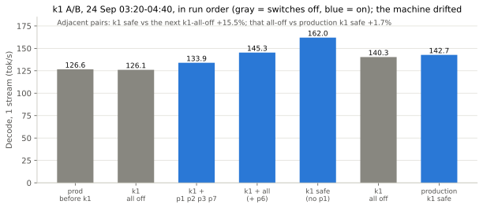

# k1: kernel and runtime patches for the MTP cycle

Measured 24 September 2026 on the same RTX 5090 (WSL2, SGLang v0.5.20, Qwen3.8-27B NVFP4 + MTP).

k1 is a Docker layer ([docker/k1](../docker/k1)) with five patches to SGLang, each behind its own environment switch
and off by default. Four of them keep the server's temp-0 output identical to before (53 of 53 test answers,
including 32K, 64K and 120K-token prompts) and now run in production. The fifth (p1) is faster but changes greedy
text, so it is held back. The speed gain is real but was not pinned down: during the test window the machine itself
drifted by more than the effect (see [Results](#results)).

## Where one MTP cycle goes

A single-stream MTP cycle (3 draft passes + one 4-token verify of the 27B) was traced with SGLang's built-in
profiler on the running server: `POST /start_profile` with the admin key, 40 cycles, no restart
([bench/profile](../bench/profile)). CUPTI traces the kernels inside CUDA-graph replays under WSL2.

- **The FP4 weight GEMMs are not the problem.** 260 NVFP4 CUTLASS calls per cycle stream about 16.65 GB at about
  1.64 TB/s, 91% of the card's rated 1,792 GB/s. A hand-written replacement could win at most a few percent, which is
  why no custom GEMM kernel was written. At 20 rows per call (5 streams) they drop to about 72% of bandwidth.
- **One bf16 projection hits a cuBLAS heuristic pathology.** The recurrent layers' `in_proj_ba` (96 x 5,120, kept in
  bf16 by the checkpoint) runs a `cutlass_80_wmma 16x16_128x1` kernel at 47.5 us per call when M = 4 (the verify
  width), but 5.5 us at M = 20. It sits on a side stream, so about 0.8 ms per cycle is exposed.
- **The GPU is idle 16-18% of the cycle.** Seven blocking host syncs per cycle (FlashInfer's `plan()` for the EAGLE
  verify, `.item()` and `.cpu()` reads, a late seq-lens copy) each cost 25-60 us under WSL2's WDDM driver, and
  launching the 1,061-node verify graph costs about 0.44 us per node before its first kernel starts.
- **The draft layer runs in bf16** (0.85 GB read per pass): about 1.5 ms per cycle, the next target.

## From profile to plan

Eight investigations (idle bubbles, the bf16 projection, the draft layer, FP4 GEMM efficiency, small-kernel fusion,
the ReplaySSM commit, energy/clocks, concurrency) each read the traces and the v0.5.20 source, then an adversarial
reviewer re-derived every claimed saving and cut what it could not verify. The patches below are the lossless top of
that ranked plan.

| Patch | Switch | What it does | Output vs before | Status |
|---|---|---|---|---|
| p1 | `SGLANG_GDN_BA_TINY_GEMM=1` | `in_proj_ba` at M <= 4 through SGLang's JIT `tiny_gemm_bf16` (about 2 us instead of 36-47 us) | 99.7% of values bit-equal to cuBLAS; greedy text changes | held back |
| p2 | `SGLANG_KV_SKIP_UNIT_SCALE_DIV=1` | skips the FP8 KV write's division by a scale of exactly 1.0 (32 kernels per cycle) | bit-exact (x / 1.0 == x) | live |
| p3 | `SGLANG_AUTOTUNE_TARGET_LMHEAD=1` | autotunes the target's NVFP4 output layer, which was captured with a fallback tactic at 1.21 TB/s | identical text in all tests | live |
| p6 | `SGLANG_EAGLE_SYNCFREE_SEAM=1` | the topk=1 verify tree is a causal chain, so verify runs causal with FlashInfer's sync-free `fast_prefill_plan` from host-known layout; the seq-lens copy is queued early; the draft kv_indptr is built on the host | identical text (53/53 vs p6 off) | live |
| p7 | `SGLANG_ATTN_MLP_SILU_FP4_FUSION=1` | the existing SiLU + mul + FP4-quant fusion for the 16 attention-layer MLPs (the 48 recurrent layers already use it) | identical text in all tests | live |

p6 carries a host-vs-device layout guard: with the seam on, the first 8 replays of each kind at each batch size
assert that the host-computed indptrs and the causal mask match what the GPU would have used. Output equality alone
cannot prove this (a host layout short by the draft width gives identical attention unless a split-kv boundary lands
in the last tokens), so the guard is on by default and `SGLANG_EAGLE_SYNCFREE_SEAM_CHECK=1` widens it for testing.

Each patch is an anchored replace-once script: it asserts exactly one match per anchor, so a different SGLang
version fails the build instead of producing a half-patched server.

## How it was tested

- **Flags off first.** The k1 image with every switch off must equal production: prefill fingerprint identical,
  greedy text 675/675, and 53/53 test answers equal.
- **Warm up before comparing.** The first run after a launch differed from production on the ten long prompts;
  a second run in the same container matched 53/53. Lazily tuned prefill GEMM tactics change the first long
  prefills, so every comparison runs on a warmed-up server ([bench/tok_equal.py](../bench/tok_equal.py)).
- **Isolate any divergence.** When the greedy text moved, one relaunch per switch found the cause, and
  [bench/near_tie.py](../bench/near_tie.py) measured the top-1 vs top-2 margin at the first differing token.
- **Quality gates** on the combined build: typed tool calls 3/3, thinking on and off, image input, recall at 60K
  context (6/6 codes, 2/2 two-hop facts), prefix-cache churn 99.9%, and 20/20 arithmetic with thinking on.

## Results

Single-stream decode, server-side median, in run order (raw rows: [bench/results](../bench/results)):

- Only adjacent runs are comparable. `k1 safe` vs the next all-off run: **+15.5%** (162.0 vs 140.3 tok/s; cycle
  15.84 vs 18.61 ms). That all-off run vs the production relaunch with the same four switches: **+1.7%** (142.7 vs
  140.3).
- Across the hour, near-identical configurations measured a single-stream cycle anywhere from 15.8 to 21.1 ms. The
  desktop (compositor, browser, chat apps) shares the 5090 with the server and Windows runs background work at night,
  and both touch the CPU-bound part of the cycle that p6 targets. A clean number needs alternating on/off runs with
  the display off.
- At 5 streams the paired runs gave +8.1% (679 vs 628 tok/s), from only 3 samples each.
- Energy per output token (GPU board, blended with idle waits): 1.70-1.78 J with the fixes vs 1.75 J without.

## Why p1 is held back

p1 was the largest single gain in the combined run (+6% on its own), and quality gates passed with it: acceptance
unchanged, recall, tools and 20/20 arithmetic. But it changes the model's numbers by more than rounding noise. On the
fixed greedy test the text departs at token 23, where production picks " Why" over " Step" by 0.25 nats and p1
picks " Step" by 0.50 nats: a 0.75-nat swing. `tiny_gemm` and cuBLAS agree on 99.7% of the bf16 outputs and the
rest differ by 1-4 bf16 ulps (0.4-3% relative), but those values set the decay and beta gates of all 48 recurrent
layers on every token, and the recurrence carries the difference forward. The outputs are not worse, only different;
shipping a change that alters answers needs a bigger quality evaluation first.

## Next

From the same ranked plan, in order: an NVFP4 draft layer and a 32K-token "hot vocabulary" draft head (together
estimated at about +15% single-stream and -10% J/token); 7 running requests instead of 5 via
`SGLANG_OPT_MAMBA_SKIP_DECODE_LOCK` (needs a soak); and, on the owner's side, taking the desktop off the 5090 (idle
52 W at P3 vs 14 W at P8, and no GPU time-slicing) and an iso-clock undervolt.

Where hand-written kernels (CUDA C++ with inline PTX, the lowest practical level on NVIDIA, which publishes no
assembler for Blackwell's machine code) would pay, from the same profile: a fused kernel for the 48 recurrent
layers (convolution update, gates, state update and norm in one pass; estimated +2-4%, testable bit for bit against
today's path), and one persistent kernel for the whole verify step, which would remove the remaining launch gaps and
small-kernel tails (estimated +10-20%, weeks of work, specific to this model). Rewriting the FP4 GEMMs is not on the
list: at 91% of rated bandwidth they have at most about 0.9 ms per cycle left to give.

Rejected with reasons: a custom swap-AB NVFP4 GEMM (80+ hours for about 0.3 ms), `--speculative-draft-model-quantization`
(a no-op on CUDA in v0.5.20), the default adaptive speculation config (drops to 0-1 draft steps at high batch), and
the metadata glue graph (would freeze the host-fed plans).
