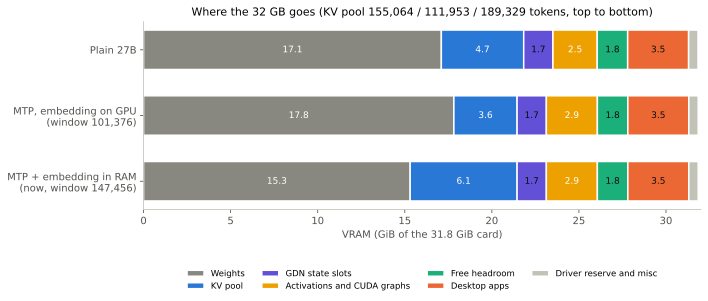
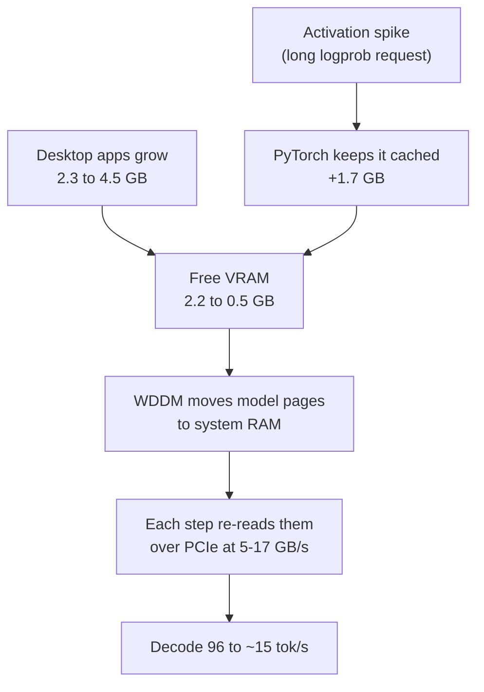
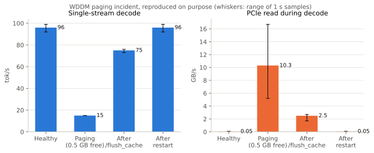
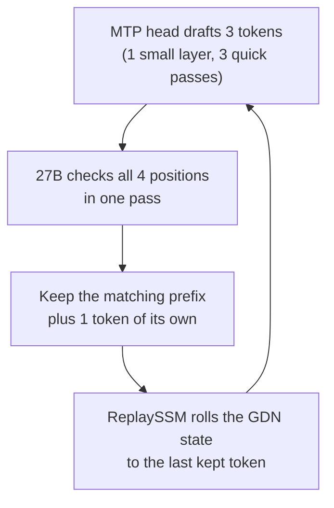
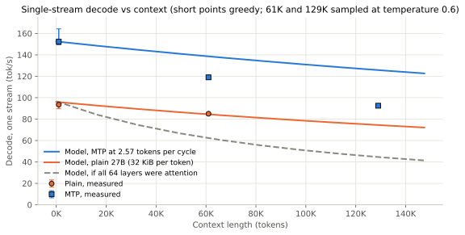

# RTX 5090 serving report: Qwen3.8-27B NVFP4 with MTP under WSL2

Measured 23 September 2026 on one RTX 5090 (Windows 11, WSL2 Ubuntu 24.04, SGLang v0.5.20, FlashInfer 0.6.18).

## Summary

The 27B now decodes about 1.6× faster, per stream and in total, at 41% less GPU energy per token, and the
147,456-token window is unchanged.

| | Plain 27B | 27B + MTP + host embedding |
|---|---|---|
| Decode, 1 stream (tok/s, median) | 93 | 152 |
| Decode, 5 streams, total (tok/s, median) | 456 | 753 |
| GPU energy per output token (J, median) | 2.91 | 1.72 |
| KV cache pool (tokens) | 155,064 | 189,329 |

- **A hidden slowdown, found and fixed.** The Windows display driver (WDDM) was silently paging model memory to
  system RAM, and decode fell as low as 15 tok/s. Three launcher guards now keep about 2 GB of VRAM free.
- **Speculative decoding.** The model's own multi-token-prediction (MTP) head drafts 3 tokens; the 27B checks them in
  one pass and keeps 2.57 on average.
- **Embedding table in RAM.** The 2.4 GiB input-embedding table sits in pinned host memory and is read row by row.
  That paid for the draft head and grew the KV pool.

The one cost is prefill: an uncached 6K-token prompt runs at 9.2-12.4K tok/s instead of 13.4-15.0K.

## The physics: why decode speed is a memory problem

Each decode step reads all 14.5 GB of weights from VRAM once, however many requests share that step. That read,
not the arithmetic, sets the speed: 10.4 ms per step, about 96 tok/s for one user. The bound, in the form Reiner
Pope draws on the blackboard in his [lecture on the Dwarkesh Patel podcast](https://www.youtube.com/watch?v=xmkSf5IS-zw&t=712s):

```math
t_{\text{step}}(B) \;\ge\; \max\left( \frac{W + B\,(S + L\,k)}{BW},\; \frac{B \cdot 2N}{F} \right)
```

- W = 14.5 GB of weights read per step (the 2.4 GiB embedding table and the vision tower are not read during text decode)
- S = 74.8 MiB of Gated DeltaNet (GDN) state per running request; L = context tokens; k = 32 KiB of FP8 KV per token
- BW = 1.79 TB/s rated; 1.40 TB/s effective, calibrated to the measured 96 tok/s
- 2N = 53 GFLOP per token; F = 1,676 TFLOPS dense FP4 peak (the compute line assumes 40% of it)


Batching is almost free below the knee: five requests step in 11.0 ms against 10.7 ms for one, so each token costs
a fifth. The knee is where per-request traffic equals the weight read:

```math
B^{*} = \frac{W}{S + L\,k} \approx 130 \text{ at 1K context}, \qquad 7 \text{ at 60K context}
```

In the lecture's picture, batching pays until the arithmetic catches up with the weight read. Here it never catches
up: one request's state and KV read (0.08 ms at 1K context) already equals its arithmetic at 40% of peak. What caps
us is neither line but the 22 GDN state slots, which allow 5 running requests.

## KV cache and memory: where the 32 GB goes

Only 16 of the model's 64 layers keep a KV cache, so each context token costs 32 KiB in FP8. The other 48 Gated
DeltaNet layers carry a fixed 74.8 MiB state per conversation instead, whatever its length.

```math
k = 2 \times n_{\text{attn layers}} \times n_{\text{kv heads}} \times d_{\text{head}} \times \text{bytes} = 2 \times 16 \times 4 \times 256 \times 1\,\text{B} = 32\ \text{KiB}
```

The full 147,456-token window therefore needs 4.5 GiB of KV. If all 64 layers were attention it would need 18 GiB,
more than the card has left after the weights. One state slot costs as much VRAM as 2,394 tokens of KV.

The launcher sizes the pool from what is left after everything else (all terms in MiB):

```math
\text{pool tokens} = \frac{f\,(T - 1826) - W_{\text{GPU}} - S\,(n_{\text{slots}} + 1) - 112}{k}, \qquad f = \frac{T - 420 - D - H - X}{T - 1826}
```

T = 32,607 MiB is the card; CUDA inside WSL2 never sees 1,826 MiB of it. D = desktop apps (measured, at least
3,584 at logon), H = 1,792 free headroom, X = 3,000 for activations. The estimate lands within 0.4% of the pool SGLang
actually allocates.



MTP brings a 0.8 GB draft layer, one more attention layer (34 KiB per token) and more activation room. On its own that
shrank the pool to 111,953 tokens and cut the window to 101,376. Moving the 2.37 GiB embedding table to pinned host
RAM paid it back: 189,329 tokens, window back to 147,456. The table is read by a small Triton kernel over unified
virtual addressing: 12 us for one decode step, 446 us for a 2,048-token prefill chunk. It is bit-exact and runs inside
CUDA graphs.

## The hidden slowdown: Windows paging the model out

The server had been running 10-85% slow without any error. Under WSL2, CUDA never reports out-of-memory: when VRAM runs
short, the Windows display driver (WDDM) quietly moves model memory to system RAM.





During the thrash, board power fell from about 390 W to 185 W: the GPU sat idle waiting for data. A cache flush
stopped the flood but left decode at 75 tok/s, because WDDM keeps demoted memory in RAM. Only a container restart
restored 96.

| Guard | Setting | Why |
|---|---|---|
| Return cached memory when idle | `SGLANG_EMPTY_CACHE_INTERVAL=30` (default -1) | PyTorch keeps every spike otherwise; 406 MB came back after 45 s idle |
| Keep free headroom | 1,792 MiB | Absorbs desktop swings of 2.3-4.5 GB during the day |
| Count the driver reserve | 420 MiB | nvidia-smi shows a constant 420 MiB reserved |
| Probe safely (test harness) | Logprobs for the last 128 positions, after a flush | A full-prompt logprob request grew the server by 1.7 GB |

To spot it: free VRAM under about 0.5 GB and GB/s of PCIe traffic during decode (`nvidia-smi dmon -s pmt`). Healthy
decode moves 15-80 MB/s. The cure is a relaunch.

## Speculative decoding with MTP: more tokens per weight read

Every step pays the 14.5 GB weight read anyway, so the cheapest speed-up is to get several tokens out of one read.
The model ships a multi-token-prediction (MTP) head for exactly this.



The 27B still decides every token: a draft survives only if the 27B would have produced it. Each cycle returns 1 to
4 tokens.

```math
E[\text{tokens per cycle}] = \frac{1-\alpha^{\gamma+1}}{1-\alpha} = \frac{1-0.71^{4}}{1-0.71} \approx 2.57
```

Here γ = 3 drafted tokens and α = 0.71, the chance each draft survives. The benchmark measured 2.57 tokens per cycle;
live chats average 2.85.

```math
\text{speed-up} = \frac{E \cdot t_{\text{step}}}{t_{\text{cycle}}} = \frac{2.57 \times 10.7\ \text{ms}}{16.9\ \text{ms}} \approx 1.6
```

A cycle costs 16.9 ms. Checking 4 positions costs about the same as decoding 1, because it is the same weight read;
the three draft passes and the state replay add about 6.5 ms. At the same memory efficiency as plain decode, the pure
traffic of a cycle would take about 13.7 ms, so roughly 3 ms per cycle is overhead that kernel and runtime work could
attack (estimate: 185-215 tok/s single stream).



MTP holds about 1.6× at short context, 1.4× at 61K and 1.3× at 129K. The long runs sample at temperature 0.6, which
lowers acceptance, and acceptance was not logged per run, so the size of the context effect is still open. For
contrast, an all-attention layout of the same size would fall to 41 tok/s at 147K.

What it took:

- **The draft weights.** The NVFP4 checkpoint ships without the MTP layer, so its 15 bf16 tensors (849 MB) were grafted
  from the RadixArk snapshot; they are byte-identical across the Qwen, RadixArk and NVIDIA releases.
- **Two open SGLang fixes.** [PR #37155](https://github.com/sgl-project/sglang/pull/37155) lets the draft share the
  embedding and output layer before the KV pool is sized; without it 4.7 GiB is stranded
  ([issue #36452](https://github.com/sgl-project/sglang/issues/36452)).
  [PR #37826](https://github.com/sgl-project/sglang/pull/37826), backported behind an environment switch, keeps the
  embedding in host RAM.
- **Flags.** EAGLE with 3 steps, top-k 1, 4 draft tokens, and ReplaySSM verification for the GDN layers.

Quality gates all pass: typed tool calls 3/3, thinking on and off, image input, recall at 60K and 129K (6/6 codes, 2/2
two-hop facts), prefix-cache churn 99.9-100%, and 20/20 arithmetic problems with thinking on.

## Throughput, concurrency and cost

At five concurrent chats the card delivers about 750 tok/s in total, up from 456, and each output token costs 1.7 J
of GPU energy instead of 2.9.


Faster decode does not raise the cap of 5 running requests. Under the lazy state strategy each running request holds
4 of the 22 GDN state slots, and every extra slot costs 74.8 MiB. What speed buys is turnover: each slot frees up 1.6×
sooner, so the same 5 slots serve about 1.6× more requests per hour before a queue forms. The slower prefill takes back
a little of that. Energy per token falls for the same reason speed rises: one weight read now yields 2.57 tokens.

| Config | Max running | KV pool (tokens) | Window (tokens) | Prefill, 6K prompt (tok/s) | GPU J per output token | GPU kWh per 1M output tokens |
|---|---|---|---|---|---|---|
| 27B + MTP | 5 | 189,329 | 147,456 | 9.2-12.4K | 1.66-1.85 | 0.48 |
| 27B plain, same guards | 5 | 155,064 | 147,456 | 13.4-15.0K | 2.87-3.05 | 0.81 |
| Qwen3.6-35B-A3B MoE | 8 | 164,419 | 131,072 | 27.3K | 0.69 | 0.19 |

Energy is GPU board power only, sampled every 0.5 s during the decode tests.

## Tested and rejected

| Idea | Result | How we know |
|---|---|---|
| FlashInfer b12x FP4 GEMM for small batches | Slower: 119-149 tok/s against 154-164, and more energy per token | A/B on the card, 2 runs each |
| Host-RAM embedding for the MoE | Saved only 0.24 GB; the pool fell to 137,841 tokens | A/B on the card |
| Other draft models (DFlash2, DSpark) | Blocked: open bugs corrupt state under concurrency ([#36548](https://github.com/sgl-project/sglang/issues/36548)) or drift from the base model ([#35150](https://github.com/sgl-project/sglang/issues/35150)) | SGLang issue tracker |
| HiCache host-RAM KV tier | No gain on this traffic; WSL2 fixes unmerged; MTP draft state not carried in host pools ([PR #40223](https://github.com/sgl-project/sglang/pull/40223)) | Code and live metrics |
| T-LRU cache eviction ([PR #34012](https://github.com/sgl-project/sglang/pull/34012)) | 0%: eviction almost never runs (63 tokens in the first hour) | Live /metrics |
| int8 GDN checkpoints | Smaller pool on the 27B, +4% on the MoE | Slot arithmetic from the checkpoint configs |
| FlashInfer 0.7 fused GDN decode step | 0%: its guard refuses our bf16 state and falls back to the unfused path | FlashInfer source |
| XQA decode attention | 0%: FlashInfer decode already runs at 83-96% of effective bandwidth | Step-time arithmetic |
| V/F-curve undervolt | Premise wrong: the software power cap bites 4-7 s per day | Driver counters |
| 16 CPUs for WSL | 0 s per model swap: the loader uses one thread per weight shard, and there are 2-3 | Loader code |

## Next levers

All gains are estimates until measured.

| Lever | Expected gain (estimate) |
|---|---|
| Move desktop apps to an integrated GPU and turn GPU overlays off | 1.5-2 GB more VRAM: 11-13 running instead of 5, and less run-to-run noise |
| Skip the decode lock on the 27B (`SGLANG_OPT_MAMBA_SKIP_DECODE_LOCK=1`) | 3 state slots per request instead of 4: 7 running on 22 slots |
| NVFP4 KV cache | About 21 KiB per token instead of 34: roughly 1.6× the pool (needs a long-recall quality gate) |
| Profile the MTP cycle, then fuse the draft loop | Most of the ~3 ms per-cycle overhead: 185-215 tok/s single stream |
| Memory overclock | Decode tracks memory clock almost 1:1 |
| Native Linux serving | 1.8 GB that WSL2 hides, no WDDM paging, HiCache and Nsight Compute usable |

## Method and sources

- **Decode** is the scheduler's own `gen throughput` log line, not a client stopwatch. Clients read 10-15% low because
  the idle GPU needs a second to clock up.
- **Load**: 1, 2 and 5 parallel 400-token replies; prefill uses uncached prompts of about 6K and 24K tokens.
- **Energy**: GPU board power sampled every 0.5 s during the decode tests; the rest of the PC is not counted.
- **Correctness**: after a cache flush, log-probabilities of the last 128 positions (bit-identical run to run on the
  plain 27B) and a 160-token greedy reply, compared with a saved reference.
- **Noise**: the Windows compositor holds 5-11% of the GPU's 3D engine even at idle, so runs vary by 4-8%. Points are
  medians of 2-4 runs; whiskers show min to max.

Sources (PR and issue states as of 24 September 2026):

- [Reiner Pope on the Dwarkesh Patel podcast](https://www.youtube.com/watch?v=xmkSf5IS-zw&t=712s): the roofline segment
- [NVIDIA RTX Blackwell GPU architecture whitepaper](https://images.nvidia.com/aem-dam/Solutions/geforce/blackwell/nvidia-rtx-blackwell-gpu-architecture.pdf), p. 47: RTX 5090 at 1,792 GB/s, 1,676 dense FP4 TFLOPS (3,352 sparse)
- [SGLang PR #37155](https://github.com/sgl-project/sglang/pull/37155) (open): share the MTP draft's embedding and output layer before the KV pool is sized
- [SGLang issue #36452](https://github.com/sgl-project/sglang/issues/36452) (open): the draft's copies shrink the KV pool
- [SGLang PR #37826](https://github.com/sgl-project/sglang/pull/37826) (open): keep the input embedding table in pinned host memory
- [SGLang issue #36548](https://github.com/sgl-project/sglang/issues/36548) (open): DFlash2 state corruption with concurrent requests
- [SGLang issue #35150](https://github.com/sgl-project/sglang/issues/35150) (open): DSpark GDN state drift from the base model
- [SGLang PR #40223](https://github.com/sgl-project/sglang/pull/40223) (open): HiCache to preserve MTP KV and recurrent state
- [SGLang PR #34012](https://github.com/sgl-project/sglang/pull/34012) (closed): tail-optimized LRU eviction

The charts are regenerated by [make_charts.py](make_charts.py) from the constants above and the rows in
[bench/results](../bench/results).
